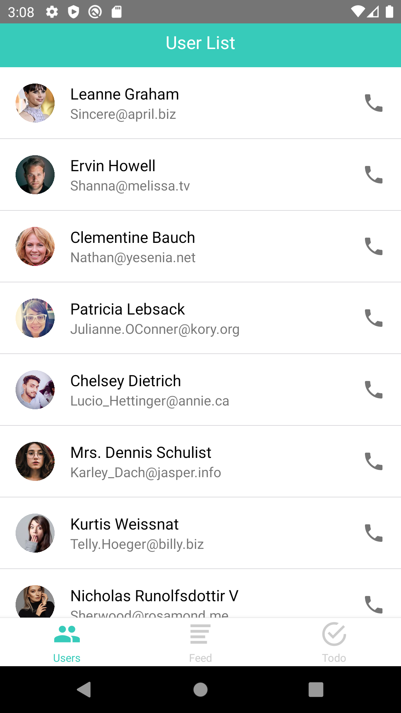
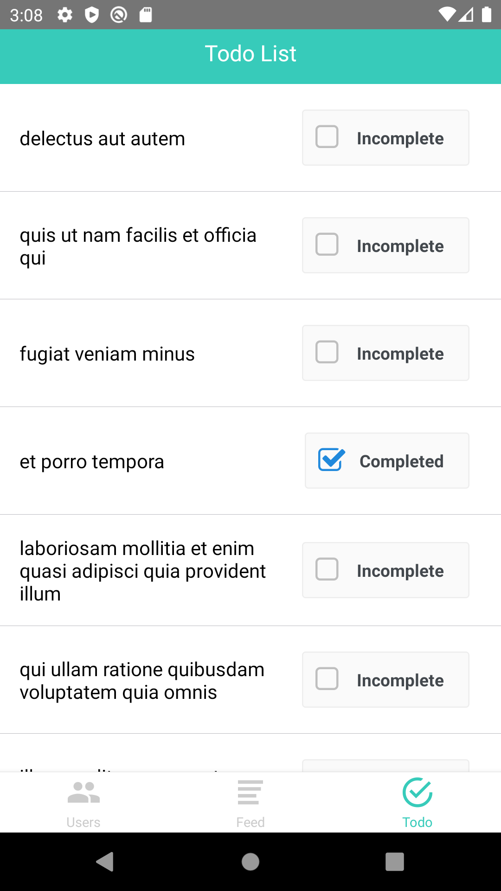

## Intro

This project will consist of three tabs:   

Users - list of users with their pertinent information   
Feed - list of posts and comments, ability to create and delete a post     
Todos - list of todos, ability to mark as complete/incomplete    

## Tools Used
React Native – Framework for building mobile apps: https://facebook.github.io/react-native/   
React Navigation – Routing for React Native apps: https://reactnavigation.org/   
Redux – Javascript state management: https://redux.js.org/   
React Native Vector Icons - Customizable Icons: https://github.com/oblador/react-native-vector-icons   
Axios – HTTP client: https://www.npmjs.com/package/axios   
JSONPlaceholder - Fake Online REST API: https://jsonplaceholder.typicode.com   
UIFaces - Avatars for design mockups: https://uifaces.co   

## Screens

   

